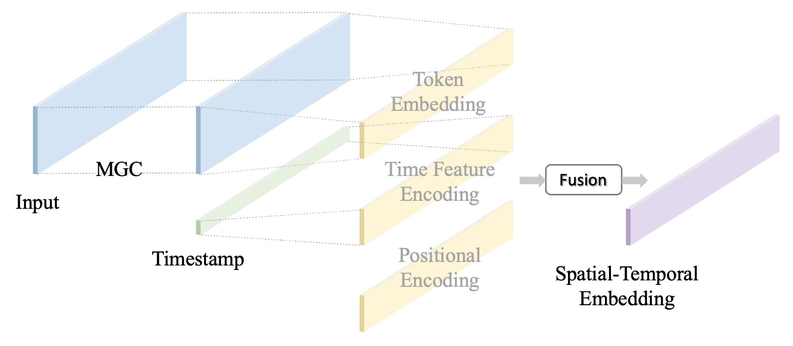

# Multi-order Graph Convolutional Informer: A global spatial-temporal deep learning model for multi-step traffic forecasting

This is the implementation of the paper: *Multi-order Graph Convolutional Informer: A global spatial-temporal deep learning model for multi-step traffic forecasting*.

Traffic forecasting is a crucial research area in intelligent transportation systems. Recently, Graph Convolutional Network (GCN) has emerged as the most popular method for spatial modeling in traffic forecasting tasks, while Transformers have been employed in numerous studies due to their superior capability for long-series sequence modeling compared to traditional recurrent neural networks. However, GCN can only extract limited local spatial information due to overfitting problems caused by stacking multiple layers and suffer from reduced flexibility. Additionally, Transformers are constrained by high time and memory complexity, as well as an encoder-decoder architecture that inherently limits their performance. To address these challenges, we propose a novel Multi-order Graph Convolutional Informer (MGCI) deep learning method, in which multi-order graph convolutional operations are utilized to enhance GCN’s global spatial modeling capabilities, and the Informer serves as a more suitable Transformer variant for global temporal modeling in longer sequential time-series forecasting.

## Overall architecture

  
<b>Figure 1.</b> Overall architecture of the proposed MGCI model.

## Multi-order Graph Convolutional Operation： Applying Global Spatial Processing in One Single Layer

  
<b>Figure 2.</b> Comparison of a single-layer multi-order graph convolutional operation and a multi-layer graph convolutional operation.

MGC combines multiple graph convolutional operations within a single layer using various graph representations and weights. This approach enables the capture of global spatial information without causing the over-smoothing problem. We enhance GCN's ability to aggregate global information without changing the conditions for aggregating information from nodes and their first-order neighbors.

## Spatial-Temporal Embedding: A comprehensive Embedding with Spatial-Temporal Information

  
<b>Figure 3.</b> Spatial-temporal embedding.

1. The multi-order graph convolutional layer extracts spatial information from input 
$\mathcal{X}{\in\mathbb{R}}^{L_\mathcal{X}\times d_X}$
, and then the conv1d layer reshapes it into 
$\mathbb{R}^{L_\mathcal{X}\times d_{model}}$. 
2. The time feature encoding extracts periodicity information from the timestamp.
3. The positional encoding stores the positional relationships between each time step in the input sequence, allowing Informer to utilize the sequential information of each time step input 
$\mathcal{X}^t$
. 

These three components are standardized to the same shape and then aggregated by weighted summation to obtain the final embedding expression. The weight coefficients are adjusted through training to improve the embedding result. 

## Informer: Efficient Transformer for Longer Sequential Time-Series Forecasting

See [this repository](https://github.com/zhouhaoyi/Informer2020/tree/main).

